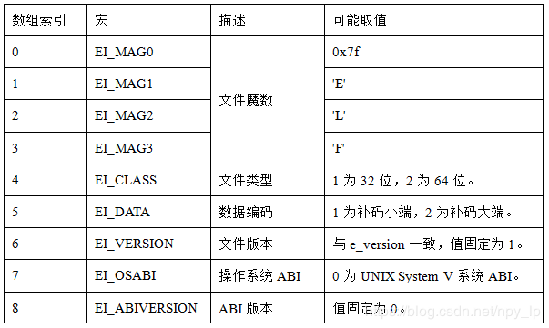
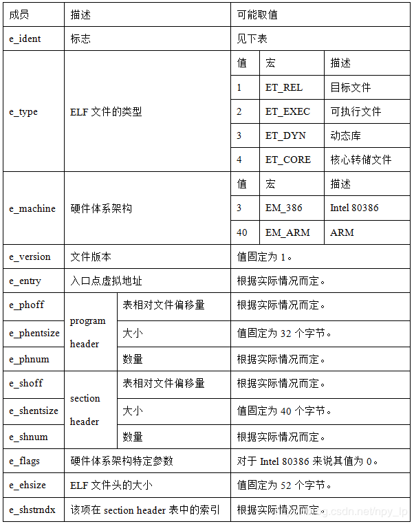
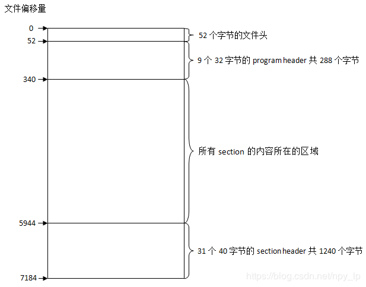
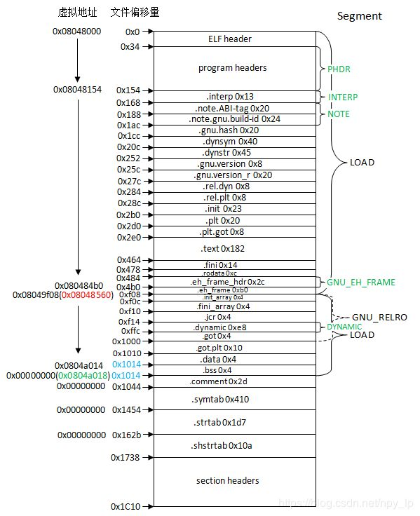
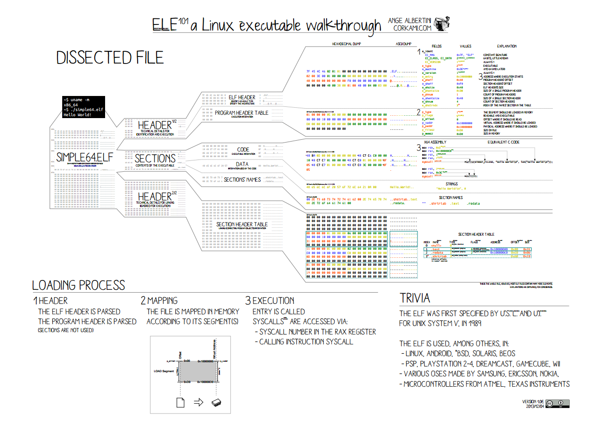
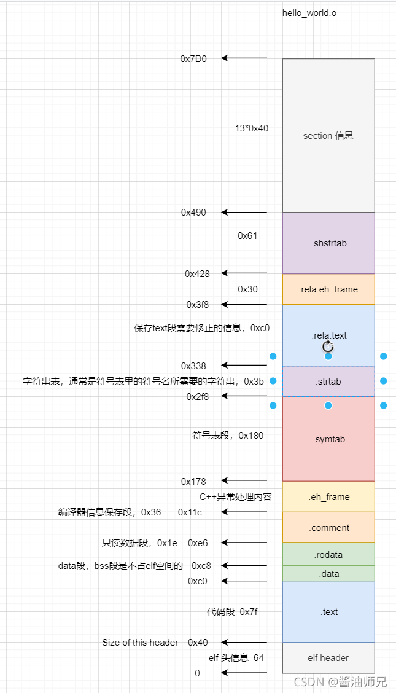
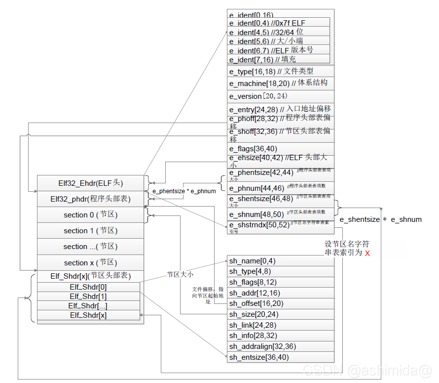
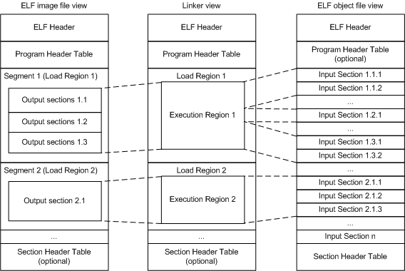

# elf解析

```
Something I hope you know before go into the coding~
First, please watch or star this repo, I'll be more happy if you follow me.
Bug report, questions and discussion are welcome, you can post an issue or pull a request.
```

## 本仓库内容

1. elf结构
2. go elf解析


## 相关站点

* GitHub地址:<https://github.com/yifengyou/parser-elf>
* GitBook地址:<https://yifengyou.gitbooks.io/parser-elf/content/>


## elf简介

PC平台流行的**可执行文件格式（Executable）**主要包含如下两种，它们都是 **COFF（Common File Format）**格式的变种。

* Windows下的**PE（Portable Executable）**
* Linux下的**ELF（Executable Linkable Format）**

目标文件就是源代码经过编译后但未进行连接的那些中间文件（Windows的.obj和Linux的.o），它与可执行文件的格式非常相似，所以一般跟可执行文件格式一起采用同一种格式存储。**在Windows下采用PE-COFF文件格式；Linux下采用ELF文件格式。**

事实上，除了可执行文件外，**动态链接库（DDL，Dynamic Linking Library）**、**静态链接库（Static Linking Library）** 均采用可执行文件格式存储。它们在Window下均按照PE-COFF格式存储；Linux下均按照ELF格式存储。只是文件名后缀不同而已。

* 动态链接库：Windows的.dll、Linux的.so
* 静态链接库：Windows的.lib、Linux的.a

**ELF(Executable and Linking Format)**，即“**可执行可连接格式**”，最初由 UNIX系统实验室(UNIX System Laboratories – USL)做为应用程序二进制接口(Application Binary Interface - ABI)的一部分而制定和发布。 ELF 作为一种可移植的格式，被TIS 应用于基于 Intel 架构 32 位计算机的各种操作系统上。

ELF 的最大特点在于它有比较广泛的适用性，通用的二进制接口定义使之可以平滑地移植到多种不同的操作环境上。这样，不需要为每一种操作系统都定义一套不同的接口，因此减少了软件的重复编码与编译，加强了软件的可移植性。

ELF 文件格式规范由**TIS(Tool Interface Standards – 工具接口标准)**委员会制定，TIS 委员会是一个微型计算机工业的联合组织，它致力于为 32 位操作系统下的开发工具提供标准化的软件接口。


## 目录

* [ELF基础](docs/ELF基础.md)
  * [elf简介](docs/基础/elf简介/elf简介.md)
  * [elf静态结构](docs/基础/elf静态结构/elf静态结构.md)
  * [elf装载](docs/基础/elf装载/elf装载.md)
  * [elf动态连接](docs/基础/elf动态连接/elf动态连接.md)
  * [elf动态连接](docs/基础/elf动态连接/elf动态连接.md)
  * [常见名词](docs/基础/常见名词.md)
* [基于GoLang的ELF解析](docs/基于GoLang的ELF解析.md)


## 规律总结

* ELF文件头的标志位总共有16个字节的大小，目前只用到9个字节，剩余字节的值都为0
* 节头大小固定0x40(64)字节，程序头大小固定0x38(56)字节
* 目标文件（也就是文件名以.o结尾的文件）不存在program header，因为它不能运行
* section header用于描述section的特性，而program header用于描述segment的特性
* 符号表的第一个元素必须是 STN_UNDEF，其代表一个未定义的符号索引，此符号表项内部所有值都为0


各种符号表：

```
.shstrtab  # 节头字符串表；节头中，每个节的名称，为其提供字符串;
.dynstr    # 与.dynsym配套，为其提供字符串
.strtab    # 与.symtab配套，为期提供字符串
```


## 图示
















 


## 参考

* <https://en.wikipedia.org/wiki/Executable_and_Linkable_Format>
* <https://www.it610.com/article/1279468031667355648.htm>
* <https://blog.csdn.net/C1033177205/article/details/121595804>


---
