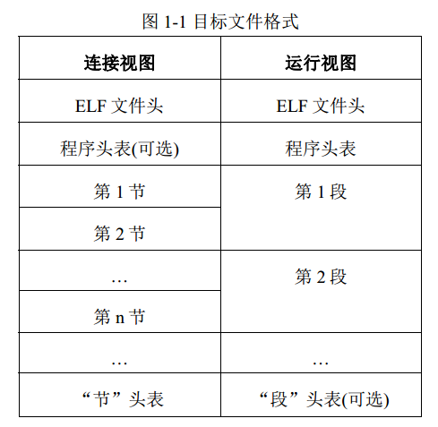

# elf头

ELF，即 **Executable and Linking Format**，译为“**可执行可连接格式**”，具有这种格式的文件称为 ELF 文件。

* ELF 规范中把 ELF 文件宽泛地称为“**目标文件 (object file)**”，这与我们平时的理解不同。
* 一般地，我们把经过编译但没有连接的文件(比如 Unix/Linux 上的.o 文件)称为**目标文件**，而 ELF 文件仅指连接好的**可执行文件**；
* 在 ELF 规范中，所有符合 ELF 格式规范的都称为 ELF 文件，也称为目标文件，这两个名字是相同的，而经过编译但没有连接的文件则称为“**可重定位文件 (relocatable file)**”或“**待重定位文件 (relocatable file)**”。
* 当提到可重定位文件时，一般可以理解为惯常所说的目标文件；而提到目标文件时，即指各种类型的 ELF 文件。

目标文件ELF 文件主要分为以下**三种**类型

* **可重定位文件(relocatable file)**，用于与其它目标文件进行连接以构建可执行文件或动态链接库。可重定位文件就是常说的**目标文件**，由源文件编译而成，但还没有连接成可执行文件。
  - 在 UNIX 系统下，一般有扩展名”.o”。之所以称其为“**可重定位**”，是因为在这些文件中，如果引用到其它目标文件或库文件中定义的符号（变量或者函数）的话，只是给出一个名字，这里还并不知道这个符号在哪里，其具体的地址是什么。
  - 需要在连接的过程中，把对这些外部符号的引用重新定位到其真正定义的位置上，所以称目标文件为“**可重定位**”或者“**待重定位**”的。
* **共享目标文件(shared object file)**，即**动态连接库文件**。它在以下两种情况下被使用：
  * 第一，在连接过程中与其它动态链接库或可重定位文件一起构建新的目标文件；
  * 第二，在可执行文件被加载的过程中，被动态链接到新的进程中，成为运行代码的一部分。
* **可执行文件(executable file)**，经过连接的，可以执行的程序文件。
  * 目标文件是由汇编器(assembler)和连接编辑器(link editor)生成的，内容是二进制，而非可读的文本形式，是可以直接在处理器上运行的代码。

## 文件格式概述

目标文件的作用有两个

1. 用于构建程序，构建动态链接库或都可执行程序，主要体现在连接的过程；

2. 用于运行程序。在这两种情况下，我们可以从不同的视角来看待同一个目标文件。

对于同一个目标文件，当它分别被用于连接和用于执行的时候，其特性是不一样的，我们所关注的内容也不一样。

从连接的角度和运行的角度，可以分别把目标文件的组成部分做以下的划分：

* ELF 文件头 (ELF header)
  位于文件的最开始处，包含有整个文件的结构信息。

* 节 (section)
  是专用于连接过程而言的，在**每个“节”中包含有指令数据、符号数据、重定位数据等等**。

* 程序头表 (program header table)
  在运行过程中是必须的，在连接过程中是可选的，因为它的作用是**告诉系统如何创建进程的镜像**。

* 节头表 (section header table)
  包含有文件中所有“节”的信息。**在连接视图中，“节头表”是必须存在的**，文件里的**每一个“节”都需要在“节头表”中有一个对应的注册项，这个注册项描述了节的名字、大小等等。**

在上图中，**程序头表紧跟在 ELF 文件头之后，节头表紧跟在节信息之后**，但在实际的文件中，这个顺序并不是固定的。**在 ELF 文件的各个组成部分中，只有  ELF 文件头的位置是固定的，其它内容的位置全都可变。**

## END
